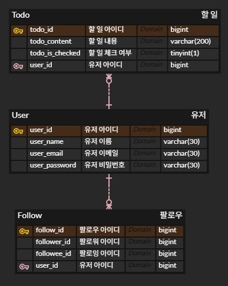
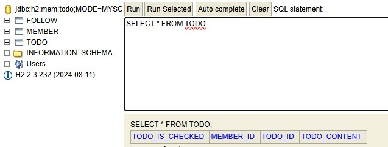
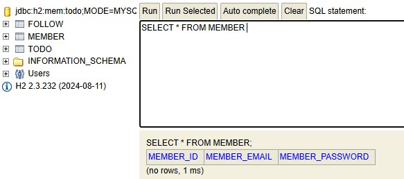
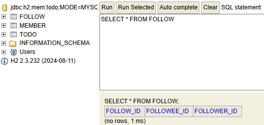

# Week 2 WIL

## DB 설계
- 
- ER Model : 문제 상황을 **개체**(entity)와 그 사이의 **관계**로 표현하는 것.
  - 개체 : 문제 상황을 구성하는 요소
  - 관계 : 개체와 개체 사이의 관계
  - ERD : ER Model을 다이어그램으로 표현한 것
  - 속성 : 개체와 관계는 세부적인 속성을 가질 수 있고, 이 때 하나의 개체를 식별할 수 있는 속성을 PK(Primary Key)라고 한다.

## TodoMate ERD 설계

- user 엔티티를 만들고 todo 엔티티와 1:N, follow 엔티티와 1:N으로 구현함
- user to user 연결은 1:N:1로 구현될 수 있음

## ERD를 통해 구현한 JAVA 코드
- Todo.java
```java
package com.example.todo_api.todo;

import com.example.todo_api.member.Member;
import jakarta.persistence.*;
import lombok.AccessLevel;
import lombok.Getter;
import lombok.NoArgsConstructor;

@Entity
@Getter
@NoArgsConstructor(access= AccessLevel.PROTECTED)
public class Todo {

    @Id
    @GeneratedValue(strategy = GenerationType.IDENTITY)
    @Column(name="todo_id")
    private Long id;

    @Column(name="todo_content")
    private String content;

    @Column(name="todo_is_checked", columnDefinition="tinyint(1)")
    private boolean ischecked;

    @JoinColumn(name="member_id")
    @ManyToOne(fetch=FetchType.LAZY)
    private Member member;

    public Todo(String content, boolean ischecked, Member member){
        this.content=content;
        this.ischecked=ischecked;
        this.member=member;
    }
}
```

- Member.java
```java
package com.example.todo_api.member;

import jakarta.persistence.*;

@Entity
public class Member {

    @Id
    @GeneratedValue(strategy= GenerationType.IDENTITY)
    @Column(name="member_id")
    private Long id;

    @Column(name="member_email",columnDefinition = "varchar(30)")
    private String email;

    @Column(name="member_password", columnDefinition = "varchar(30)")
    private String password;
}
```

- Follow.java
```java
package com.example.todo_api.follow;


import com.example.todo_api.member.Member;
import jakarta.persistence.*;
import lombok.AccessLevel;
import lombok.Getter;
import lombok.NoArgsConstructor;

@Entity
@Getter
@NoArgsConstructor(access=AccessLevel.PROTECTED)
public class Follow {

    @Id
    @GeneratedValue(strategy = GenerationType.IDENTITY)
    @Column(name="follow_id")
    private Long id;

    @ManyToOne(fetch=FetchType.LAZY)
    @JoinColumn(name="follower_id")
    private Member follower;

    @ManyToOne(fetch=FetchType.LAZY)
    @JoinColumn(name="followee_id")
    private Member followee;

    public Follow(Member follower, Member followee){
        this.follower=follower;
        this.followee=followee;
    }
}
```

## 테이블 생성 결과




## 느낀 점
- 확장성 있는 시스템을 만들기 위해 ERD 설계가 중요함을 알게 되었다.
- 각 엔티티 내의 세부 기능들을 설계하고 구현하는 과정이 궁금해졌다.