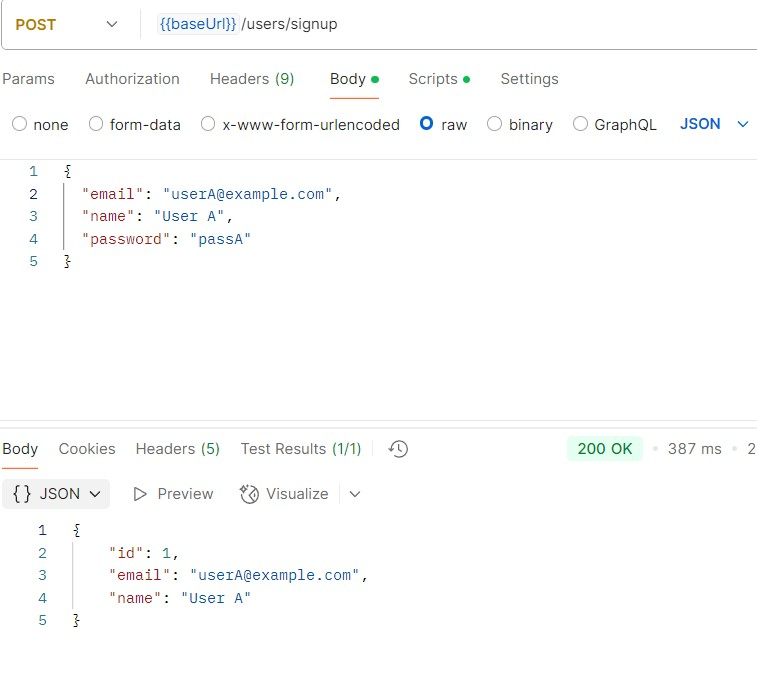
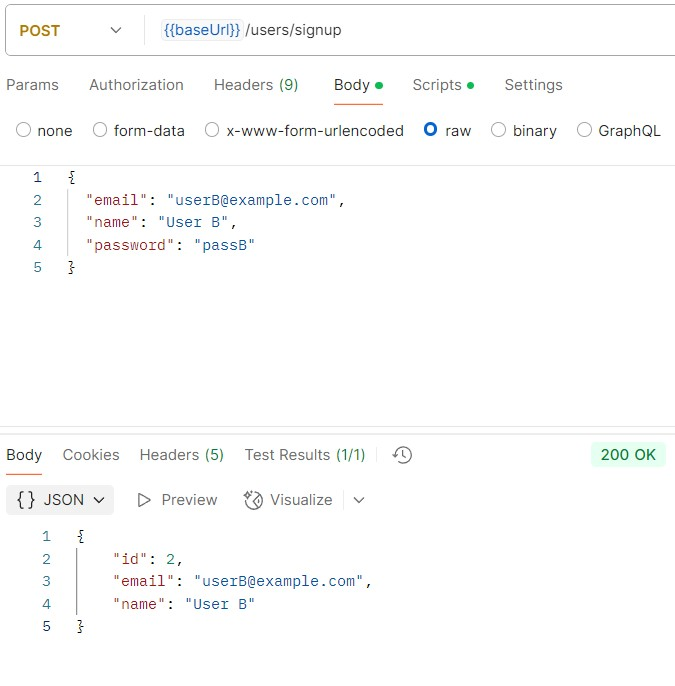
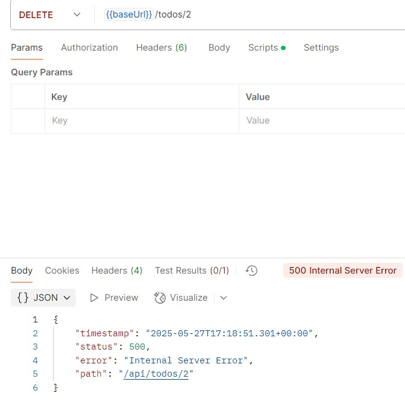
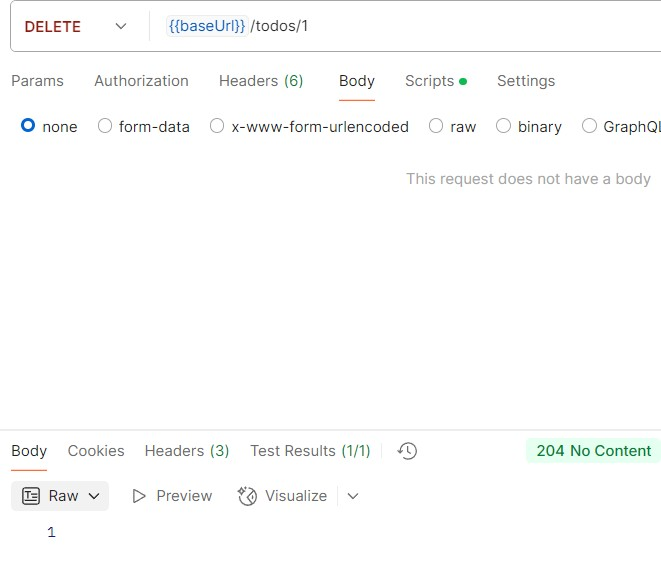

# 4주차 WIL

## Service 계층
- 어플리케이션의 비즈니스 로직을 수행한다.
- Repository 계층과 소통하며 엔티티 또는 DTO로 소통한다.

## Controller 계층
- 클라이언트의 요청을 받고, 응답을 보낸다.
- DTO(Data Transfer Object)를 사용하여 서비스 계층과 데이터를 주고받는다.

## 실제 구현

- A라는 회원의 가입 요청과 그에 대한 응답

- B라는 회원의 가입 요청과 그에 대한 응답

- 새로운 할 일 생성 (할 일 id =1)

- 할 일 조회

- 할 일 변경

- ischecked 토글

- 할 일 삭제 (존재하지 않는 할 일에 대해 삭제를 시도하여 에러가 발생한 모습)

- 할 일 삭제 (성공)

## 느낀 점
- Service 계층에서 예외처리나 특수한 경우를 생각하고 충돌을 예방하는 것이 가장 중요해 보인다. 이 계층을 얼마나 잘 구현하는지가 좋은 프로그램을 결정 짓는 중요한 요소가 될 것 같다고 생각했다.
- 열심히 구현했다고 생각했는데 오류가 너무 많아서 좌절스럽기도 했지만 어찌저찌 어느정도 해결한 것 같다.
- 고쳐야 할 부분이 많지만 조금씩 테스트해보면서 개선해나가면 될 것 같다.