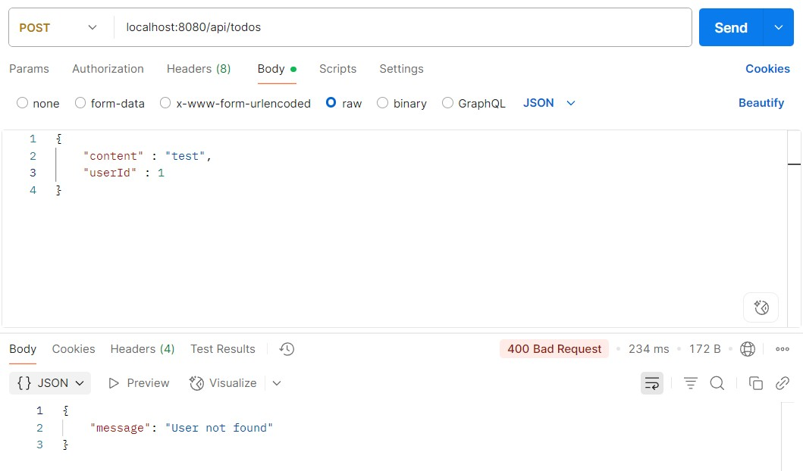
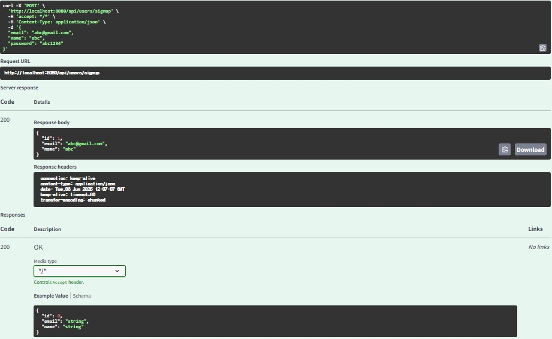

# 6주차 WIL

## 유효성 검사
- 클라이언트의 요청이 잘못된 경우, 서버에서 이를 사전에 감지하여 적절한 응답을 제공해야 한다.
- 예를 들어 데이터베이스에서 content 필드의 최대 길이가 200으로 제한되어 있는데, 클라이언트가 400자의 문자열을 전송하면 서버에서 500 에러가 발생할 수 있다. 하지만 이는 사실 서버의 문제가 아니라 클라이언트의 잘못된 요청이므로 400번대의 에러 코드로 응답되어야 한다.


- 의존성 추가
```java
implementation 'org.springframework.boot:spring-boot-starter-validation'
```

- DTO 클래스에 제약 조건 명시
```java
import javax.validation.constraints.Size;

public class ContentRequest {
    @Size(max = 200, message = "Content는 최대 200자까지 입력 가능합니다.")
    private String content;
    // ...
}
```

- 컨트롤러에서 @Valid 사용
```java
@PostMapping("/contents")
public ResponseEntity<Void> createContent(@Valid @RequestBody ContentRequest request) {
    // ...
}
```

## 예외 처리
- GlobalExceptionHandler 클래스 생성
```java
@RestControllerAdvice
public class GlobalExceptionHandler {
    @ExceptionHandler(MethodArgumentNotValidException.class)
    public ResponseEntity<ErrorResponse> handleValidationExceptions(MethodArgumentNotValidException ex) {
        String errorMessage = ex.getBindingResult().getAllErrors().get(0).getDefaultMessage();
        return ResponseEntity.badRequest().body(new ErrorResponse(errorMessage));
    }

    @ExceptionHandler(Exception.class)
    public ResponseEntity<ErrorResponse> handleAllExceptions(Exception ex) {
        return ResponseEntity.status(HttpStatus.INTERNAL_SERVER_ERROR)
                             .body(new ErrorResponse("서버 오류가 발생했습니다."));
    }
}
```

- ErrorResponse 클래스 생성
```java
public class ErrorResponse {
    private String message;

    public ErrorResponse(String message) {
        this.message = message;
    }

    // Getter, Setter
}
```
- 예외처리 결과 사진


## Swagger
- 프론트엔드 개발자나 외부 개발자와의 협업 시 , API의 사용 방법을 명확하게 전달하기 위해 필요하다. 
- 자동화된 문서를 통해 API의 구조, 요청/응답 형식, 상태 코드 등을 쉽게 확인할 수 있다.


## 느낀 점
- 예외 처리를 더 신경써서 여러 케이스에 대해 했어야 하는데 기말고사 공부가 급해서 강의보고 따라하는 정도만 했다. 시험 끝나고 예외처리 리팩터링 해야한다.
- 예외 처리를 각 서비스계층에서 하는 것보다 global로 만들어서 각 상황에 맞는 에러를 반환하는 것이 훨씬 효율적인 것 같다.
- spring 주석 도구로 JavaDoc만 써보고 Swagger를 처음 써봤는데, Swagger가 시각적인 정보를 많이 제공해줘서 코드에 대해 좀 더 직관적으로 이해하기 좋은 것 같다. 앞으로 애용할 것 같다.
